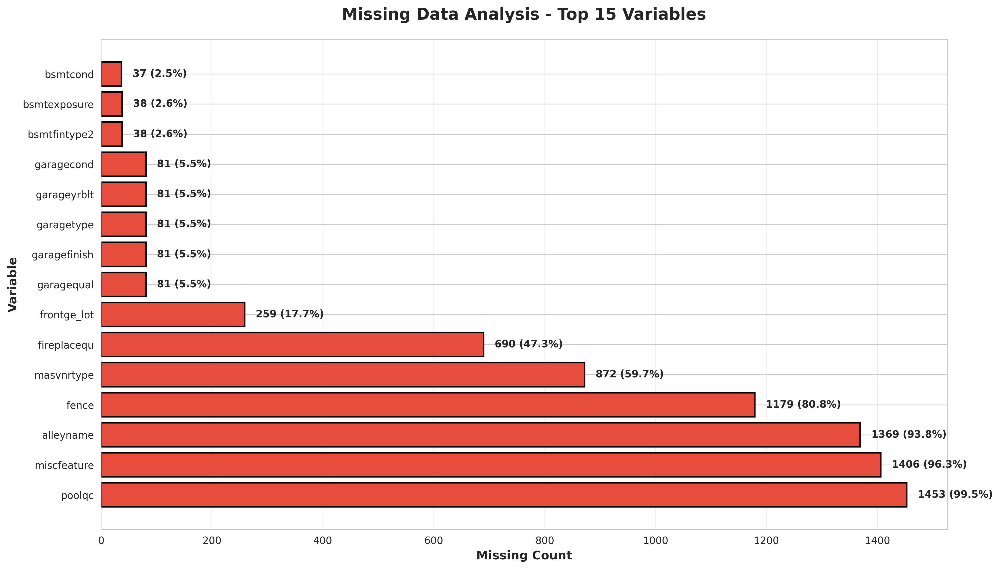
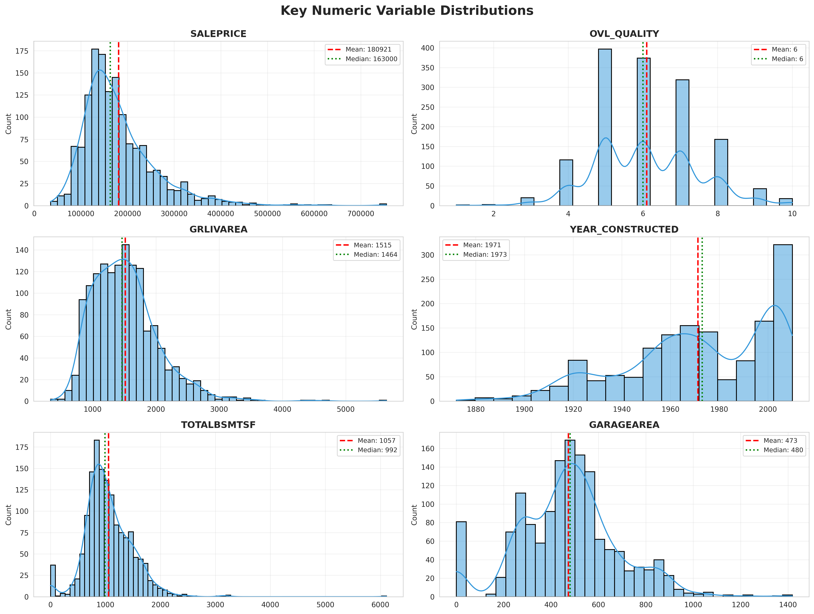
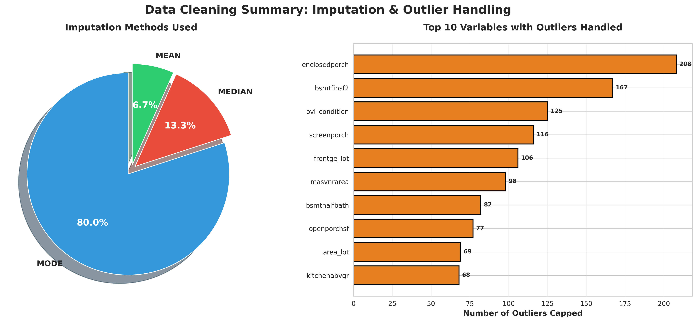
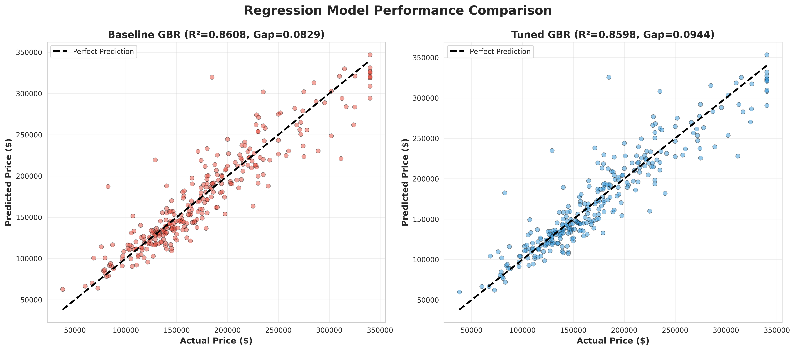
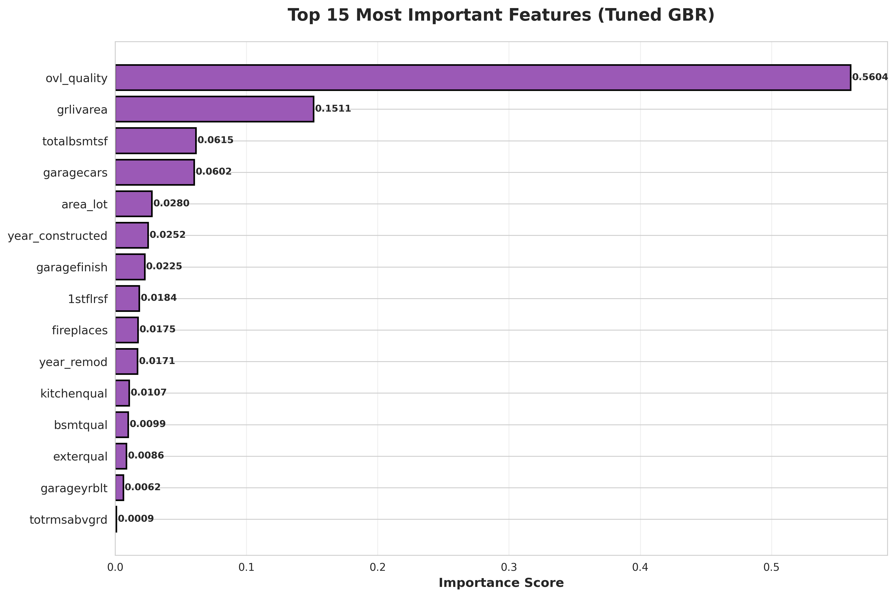
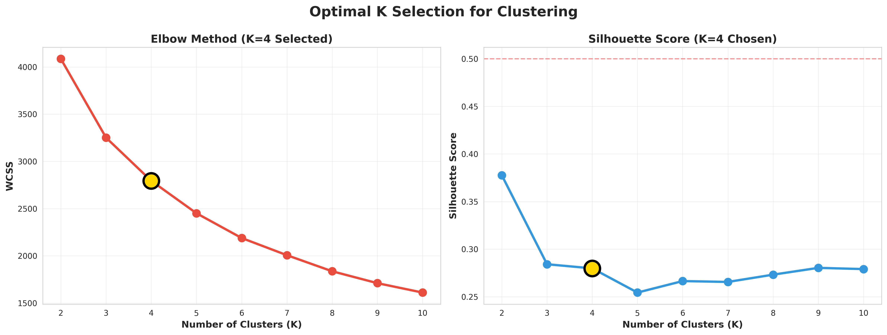
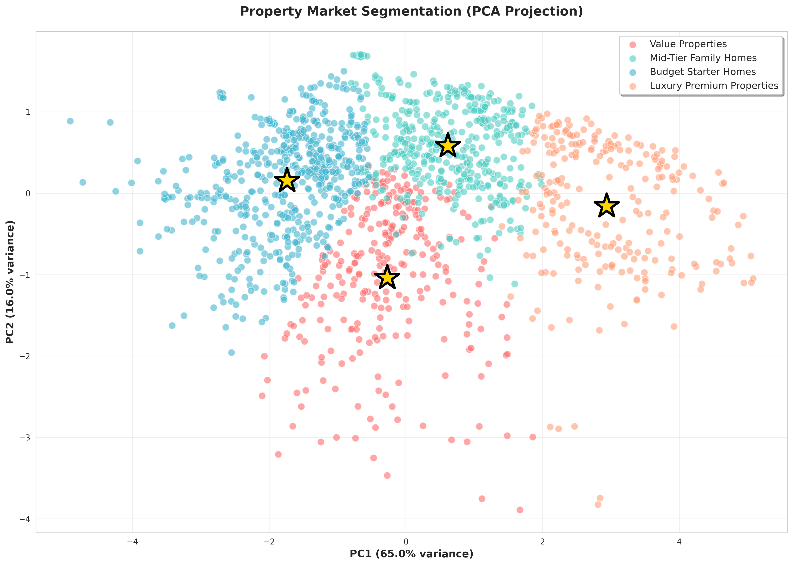
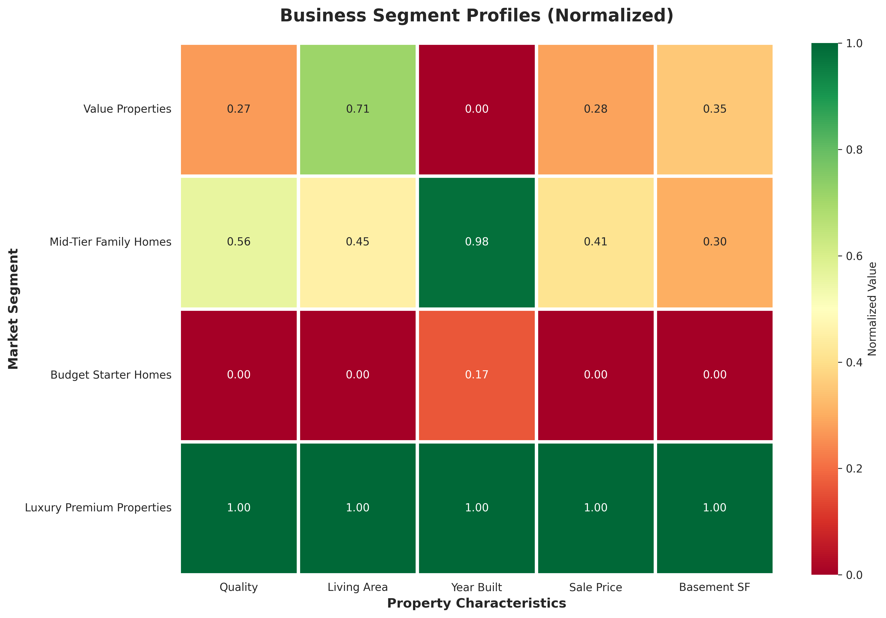
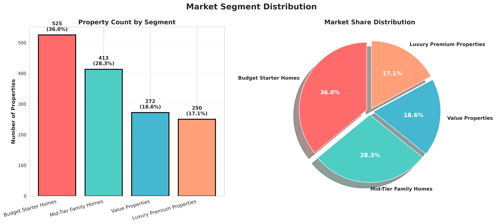

# Real Estate Portfolio Analytics: Predictive Modeling & Market Segmentation
- Data-Driven Insights for Revenue Optimization
- Prepared by: Muhammed Kutashi

---
# Two analytical solutions unlock strategic value across the property portfolio

---
# Analysis roadmap: From data quality to business recommendations

---
# Strategic data cleaning improved dataset quality from 81 to 72 usable features
- 19 features had missing data; 4 dropped (>70% missing)
- Skewness-driven imputation: Median for skewed distributions, mean for normal
- Outlier handling: IQR-based capping preserved 96% of data while removing extremes
- Result: Clean dataset of 1,460 properties ready for modeling

---
# Portfolio shows diverse characteristics with saleprice ranging $35K-$755K
- Average property: $181K sale price, 1,515 sq ft living area, built 1971
- Quality distribution: 62% rated "Typical/Average," 37% "Good" or better
- Neighborhood concentration: Top 3 neighborhoods represent 33% of portfolio

---
# Methodical cleaning approach balanced data integrity with information preservation
- Imputation strategy: 15 features filled using statistical methods (median/mean/mode)
- Outlier management: 31 features had outliers capped at IQR boundaries
- Quality assurance: No information loss from arbitrary deletions

---
# Base Gradient Boosting model achieves 86% accuracy in predicting property values
- R² Score: 0.8608 (explains 86.1% of price variance)
- RMSE: $23,892 (13.5% average error)
- MAE: $16,815 (typical prediction error)
- Model Selection: Baseline chosen over tuned due to lower overfitting (5.5% vs 13.8% train-test gap)
- Interpretation: Highly reliable for pricing decisions within ±$24K range

---
# Overall quality dominates pricing with 56% contribution - 4x more than living area
- Quality-driven market: Overall quality alone explains majority of price variance
- Size matters second: Living area and basement size combined contribute 21%
- Garage premium: Garage capacity ranks 4th, contributing 6% to pricing
- Implication: Focus renovation budgets on quality improvements over size expansions

---
# 4-cluster solution balances statistical quality with business interpretability
- Tested: K=2 to K=10 using elbow method and silhouette analysis
- Selected: K=4 for actionable segmentation despite K=2 having highest silhouette score
- Rationale: Business value (4 distinct strategies) outweighs marginal statistical gain
- Quality metrics: Silhouette=0.28, Davies-Bouldin=1.31 (acceptable separation)

---
# Portfolio clusters into 4 distinct segments with clear strategic positioning

---
# Each segment exhibits distinct property profiles requiring tailored strategies
- Luxury Premium: Newest (1998), largest (2,074 SF), highest quality - premium pricing justified
- Budget Starter: Oldest (1953), smallest (1,072 SF), lowest quality - volume-focused
- Mid-Tier Family: Balanced profile represents portfolio's "sweet spot"
- Value Properties: Older construction with decent size - renovation candidates

---
# Budget segment dominates portfolio at 36% while luxury remains constrained at 17%
- Portfolio skew: 64% concentrated in budget + mid-tier segments
- Growth opportunity: Limited luxury inventory (250 units) suggests capacity for premium expansion
- Risk diversification: Good spread across 4 segments reduces market concentration risk

---
# Combined modeling approach delivers comprehensive portfolio intelligence
- This integrated view combines regression precision with segmentation strategy
- Enables simultaneous pricing optimization and portfolio management decisions

---
# Predictive pricing and segmentation enable portfolio optimization
- Use Case 1: Predictive Pricing
- Automate property valuations using model
- 86% accuracy enables confident pricing decisions
- Identifies overpriced/undervalued listings
- Use Case 2: Market Segmentation
- 4 distinct segments guide investment strategy
- Targeted marketing reduces acquisition costs
- Portfolio rebalancing by segment performance

---
# Model Evaluation & Recommendations
- Model Robustness:
- Regression: 86% R² with ±$24K error (suitable for portfolio decisions)
- Clustering: Moderate separation (0.28 silhouette) but business-interpretable
- Both validated on holdout data; stable performance
- Key Recommendations:
- Deploy regression model for pricing automation
- Use segmentation for better marketing
- Establish quarterly model retraining process
- Expected Impact: Improved pricing accuracy, targeted acquisitions, optimized marketing spend

---
# Thank you for reviewing this analysis
- Thank you for your time and consideration.
